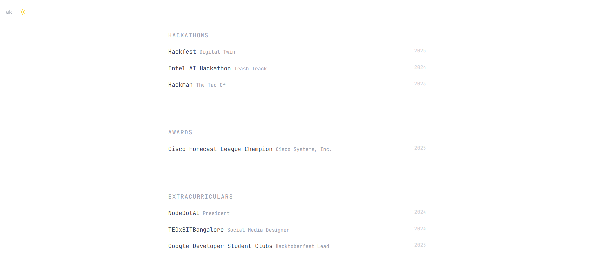
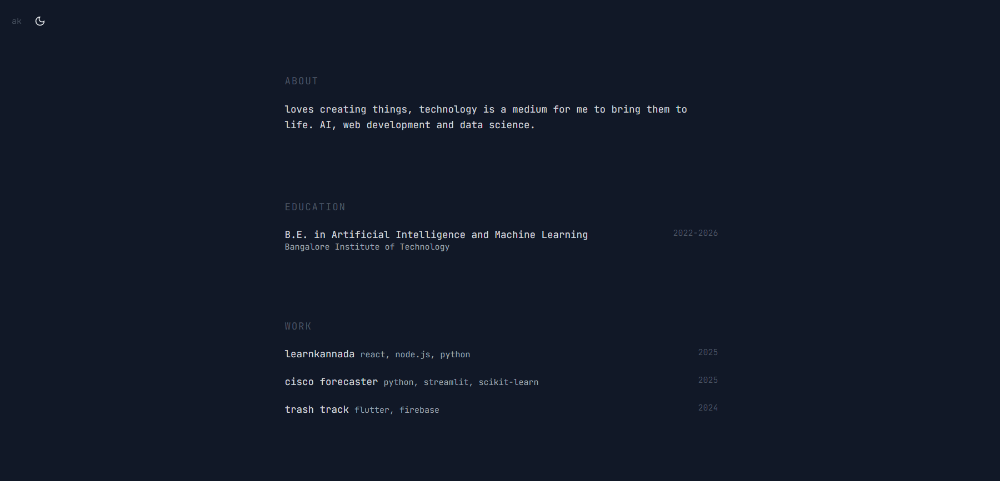
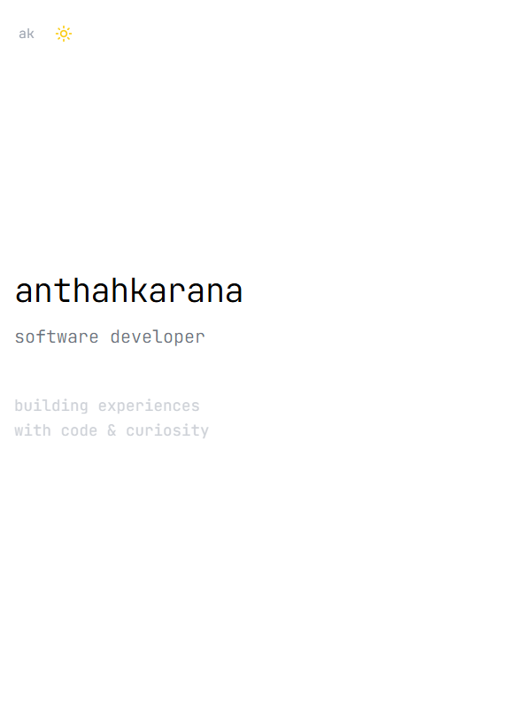
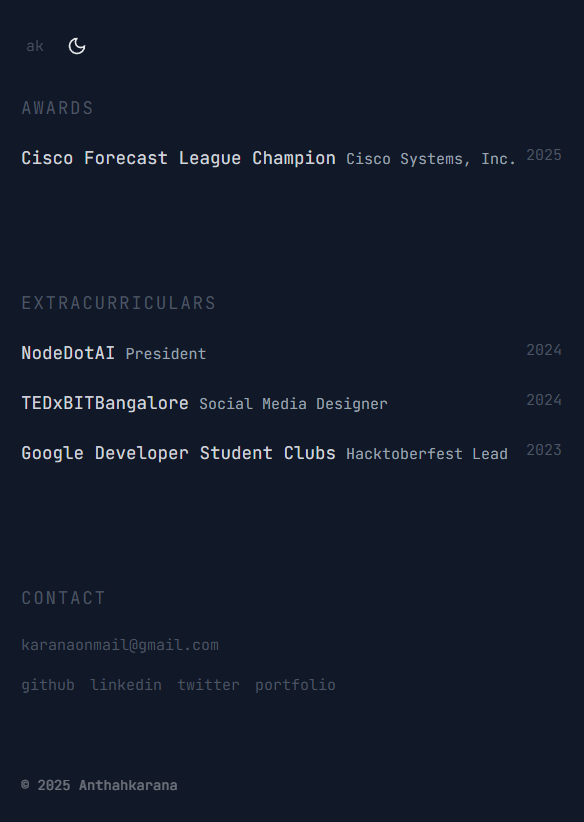

# MonoLetter - Minimal Portfolio Template

> A clean, minimalist portfolio template for developers. Built with React, TypeScript, and Tailwind CSS by Anthahkarana.

## ✨ Features

- **Clean Design**: Minimal, typography-focused aesthetic
- **Dark/Light Mode**: Theme toggle with smooth transitions
- **Fully Responsive**: Works perfectly on all devices
- **Modern Stack**: React 18, TypeScript, Vite, Tailwind CSS
- **Ready Sections**: Hero, About, Projects, Education, Awards, Contact
- **Easy Customization**: Simple configuration and styling
- **Fast Performance**: Optimized build with Vite

## 🛠 Tech Stack

- **Frontend**: React 18, TypeScript, Vite
- **Styling**: Tailwind CSS, CSS Animations
- **UI Components**: Radix UI, shadcn/ui, Lucide Icons
- **Tools**: ESLint, PostCSS, React Router

## 📸 Screenshots

### Desktop & Mobile Views
| Light Theme | Dark Theme |
|-------------|------------|
|  |  |
|  |  |

## 🚀 Quick Start

```bash
# Clone the template
git clone https://github.com/githubber-me/monoletter
cd monoletter

# Install dependencies
npm install

# Start development server
npm run dev

# Open http://localhost:8080
```

## 🎨 Customization

### Quick Checklist
- [ ] Update name and title in Hero section
- [ ] Replace projects with your work
- [ ] Add your education background
- [ ] Update contact information
- [ ] Replace favicon (`public/favicon.ico`)
- [ ] Customize colors in `tailwind.config.ts`

### Project Structure
```
src/
├── components/
│   ├── ui/              # Reusable UI components
│   ├── Hero.tsx         # Landing section
│   ├── About.tsx        # About section
│   ├── Projects.tsx     # Projects showcase
│   ├── Education.tsx    # Education background
│   ├── Contact.tsx      # Contact info
│   └── ...
├── pages/
│   └── Index.tsx        # Main page
└── App.tsx             # App root
```

## 📝 Available Scripts

```bash
npm run dev      # Development server
npm run build    # Production build
npm run preview  # Preview build locally
npm run lint     # Run ESLint
```

## 🚀 Deployment

### Vercel (Recommended)
1. Push to GitHub
2. Import project in Vercel
3. Deploy automatically

### Netlify
1. Build: `npm run build`
2. Deploy `dist` folder

### Other Platforms
- **Build command**: `npm run build`
- **Output directory**: `dist`
- **Node version**: 18+

## 🎯 Customization Examples

### Add Your Projects
```typescript
// src/components/Projects.tsx
const projects = [
  {
    title: "learnkannada",
    tech: "react, node.js, python",
    year: "2025"
  },
  // Add more projects...
];
```

### Update Personal Info
```typescript
// src/components/Hero.tsx
<h1>your-name</h1>
<p>your professional title</p>
```

### Custom Colors
```typescript
// tailwind.config.ts
theme: {
  extend: {
    colors: {
      primary: '#your-color',
    },
  },
}
```

## 🤝 Contributing

1. Fork the repository
2. Create feature branch: `git checkout -b feature/amazing-feature`
3. Commit changes: `git commit -m 'Add amazing feature'`
4. Push to branch: `git push origin feature/amazing-feature`
5. Open a Pull Request

## 📄 License

MIT License - feel free to use this template for your portfolio!

## 👨‍💻 Developed By

**MonoLetter** was created and is maintained by [anthahkarana](https://linkedin.com/in/anthahkarana).

- **Portfolio**: [anthahkarana.tech](https://anthahkarana.tech)
- **GitHub**: [@githubber-me](https://github.com/githubber-me)

Built with passion for clean, accessible, and performant web experiences.

## 🙏 Support

- ⭐ **Star this repo** if it helped you!
- 🐛 **Report issues** on GitHub
- 💡 **Suggest improvements** via discussions
- 🔄 **Share with other developers**

---